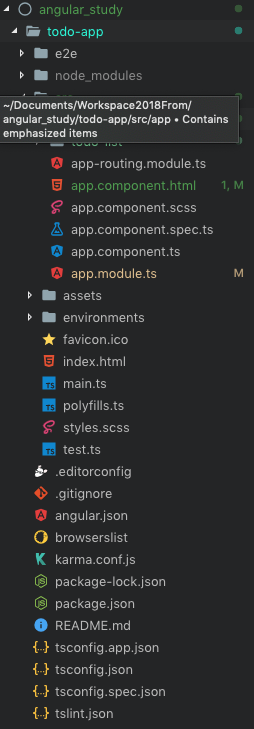

# angular 학습 내용 정리 

## 환경 셋팅

1. npm install -g @angular/cli
1. ng new 프로젝트폴더명
1. cd 프로젝트폴더명

## 프로젝트 실행

1. ng serve

## 앵귤러 기본 구조

- g new 프로젝트폴더명 을 실행하면 기본적으로 아래와 같은 폴더구조를 띄면서 생성이 됨.
    

- src 폴더는 실제 코드가 들어가 있는 부분
- src/index.html : 실제 사용자가 바라보는 파일 (<app-root> 엘리먼트를 만들어서 줌 / 엘리먼트명은 변경 가능)
- src/main.ts : index.html 파일을 받았을 때 먼저 실행되는 파일
    - AppModule : 부트스트랩 모듈을 실행 (src/app/app.module.ts)
- /app/app.module.ts
    - declarations : 컴포넌트
    - import : 삽입할 컴포넌트
    - provider : 서비스 로직
    - bootrstrap : 처음 실행할 컴포넌트를 지정해줌

    ```javascript
    declarations: [AppComponent],
    bootstrap : [AppComponent]  
    ```
    - *데코레이터 : 장식자, 장식을 해주는 것. 모듈로 만들어 주겠다. 어떤 독립이 가능한 기능의 상자.*
    - 모듈 안에는 JSON 형태가 들어가있다.
    - 모듈이라는 것이 있고, 앱에서 부팅하기를, 부트스트랩에서 앱컴포넌트 모듈을 실행하겠다.

- 사용자가 바라보는 파일은 index.html / main.ts / app-root(루트로할 엘리먼트) 모듈을 실행시킴.
- /app/app.component.ts : 객체를 컴포넌트(레고 조각)로 만든다.
    - 앱컴포넌트는 @Component 데코레이터 사용한다.
    - selector : 엘리먼트 네임
    - templateUrl : 템플릿 경로 
    - styleUrl : 스타일 경로
    ```javascript
    @Component({
        selector: 'app-root',
        templateUrl: './app.component.html',
        styleUrls: ['./app.component.scss']
    })
    ```
    - 컴포넌트명.ts, 컴포넌트명.html, 컴포넌트명.scss 이렇게 세 개가 컴포넌트를 생성하면 자동으로 생김.
- router-oulet은 앵귤러 라우팅에서 지원해주는 것이다. 
- 관련 내용 링크 : [Angular CLI 로 프로젝트 시작하기(Angular 2, Angular 4)](https://medium.com/witinweb/angular-2-cli-%EB%A1%9C-%ED%94%84%EB%A1%9C%EC%A0%9D%ED%8A%B8-%EC%8B%9C%EC%9E%91%ED%95%98%EA%B8%B0-11a188e17223)